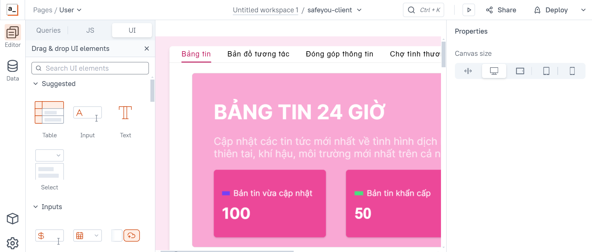
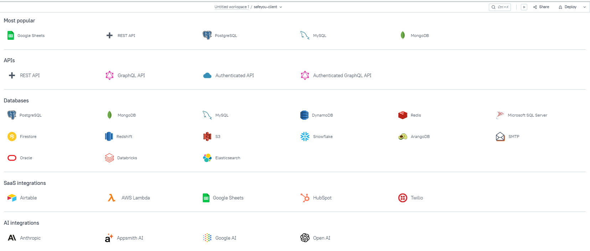
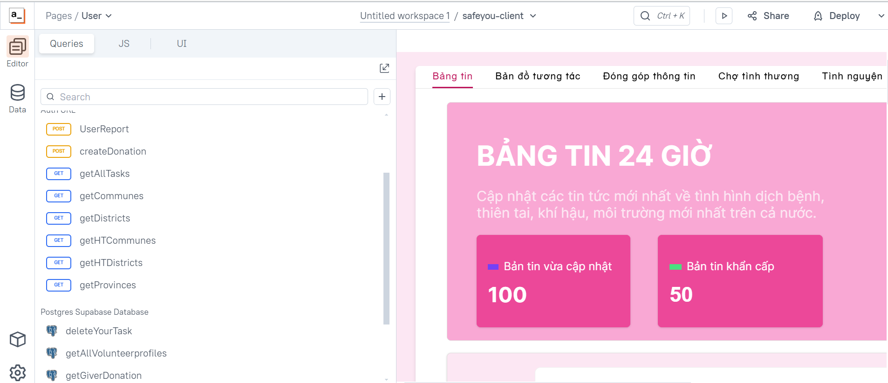

# Hướng dẫn cách đóng góp
## Cách đóng góp vào Safe You
Có nhiều cách bạn có thể đóng góp.

#### 🐛 Báo cáo lỗi
Báo cáo tất cả các vấn đề thông qua GitHub Issues sử dụng mẫu [Báo cáo lỗi](https://github.com/UTE-SafeYou/safeyou-client/issues/new?assignees=&labels=&projects=&template=b%C3%A1o-c%C3%A1o-l%E1%BB%97i.md&title=báo-cáo-lỗi). Để giúp giải quyết vấn đề của bạn nhanh chóng, hãy đọc mẫu và cung cấp tất cả thông tin yêu cầu.

#### 🛠 Gửi yêu cầu tính năng
Chúng tôi hoan nghênh tất cả các yêu cầu tính năng, dù là thêm chức năng mới cho một phần mở rộng hiện có hay đề xuất một ý tưởng cho một phần mở rộng hoàn toàn mới.
Gửi yêu cầu tính năng của bạn thông qua GitHub Issues sử dụng mẫu [Yêu cầu về tính năng](https://github.com/UTE-SafeYou/safeyou-client/issues/new?assignees=&labels=&projects=&template=y%C3%AAu-c%E1%BA%A7u-t%C3%ADnh-n%C4%83ng.md&title=).

#### 📝 Cải thiện tài liệu
Trong quá trình phát triển các tính năng nhanh chóng, chúng tôi có thể quên cập nhật tài liệu của mình. Bạn có thể giúp bằng cách đề xuất cải tiến tài liệu của chúng tôi thông qua các [Mẫu tài liệu](https://github.com/UTE-SafeYou/safeyou-docs/tree/main?tab=readme-ov-file).

#### ⚙️  Đóng góp một vấn đề về lỗi / tính năng
Chúng tôi hoan nghênh những đóng góp giúp Safe You trở nên không có lỗi và cải thiện trải nghiệm người dùng. Hãy đóng góp [Tại đây](https://github.com/UTE-SafeYou/safeyou-docs/tree/main?tab=readme-ov-file).

### 🌍 Về đóng góp các chức năng của ứng dụng

Chúng tôi hoan nghênh các đóng góp để làm cho Safe You ngày càng tốt hơn! Để đóng góp:

1. Fork repository.
2. Tạo một nhánh mới cho tính năng hoặc bản sửa lỗi của bạn.
3. Commit thay đổi và đẩy chúng lên nhánh của bạn.
4. Tạo một pull request với mô tả chi tiết về thay đổi.

#### 👨‍💻 Đóng góp các thành phần trên giao diện
Vào Editor -> UI -> + New UI element và sau đó, bạn có thể tạo các thành phần trên UI. Bạn hãy kết hợp nó với việc xây dựng các truy vấn để tạo nên một chức năng hoàn chỉnh.

#### 👨‍💻 Đóng góp các truy vấn 
Vào phần Editor -> Queries và sau đó, bạn có thể tạo các truy vấn từ đa dạng Datasource.
 

## Cách đóng góp vào Appsmith
Bạn có thể đọc thêm [Tại đây](https://docs.appsmith.com/)

