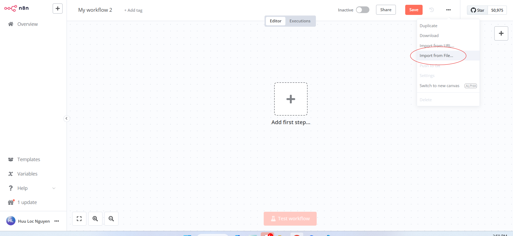

# Hướng dẫn cài đặt backend

## Yêu cầu hệ thống
- [Node.js](https://nodejs.org/en/) >= 14.x
- [Docker](https://docs.docker.com/get-docker/)
- [Docker Compose](https://docs.docker.com/compose/install/)
- [n8n](https://docs.n8n.io/getting-started/installation)
- [RabbitMQ](https://www.rabbitmq.com/download.html)
- [Git](https://git-scm.com/)
- [Supabase CLI](https://supabase.io/docs/guides/cli)

## Các bước cài đặt

#### 1. Clone mã nguồn từ Github:
```sh
git clone https://github.com/UTE-SafeYou/safeyou-baas.git
```

#### 2. Chuyển vào thư mục mã nguồn:

```sh
cd safeyou-baas
```

#### 3. Khởi tạo n8n và RabbitMQ:

```sh
docker-compose up -d
```

#### 4. Khởi động supabase:

```sh
supabase start
```

#### 5. Khởi tạo local database:

```sh
supabase db reset
```

#### 6. Thiết lập các biến môi trường:

```sh
cp supabase/.env.example supabase/.env
```

#### 7. Khởi động Edge Function:

```sh
supabase functions serve --env-file supabase/.env
```

#### 8. Thiết lập n8n workflow:
   - Truy cập vào địa chỉ `http://localhost:5678`
   - Chọn import from file
<p align="center">
    
</p>
   - Chọn file trong `safeyou-baas\automation\Send_Notification.json`
<p align="center">
    
</p>
   - Thêm các biến môi trường trong workflow
<p align="center">
    
</p>
<p align="center">
    
</p>
<p align="center">
    
</p>
   - Lưu workflow
   - Chạy workflow

<p align="center">
    
</p>