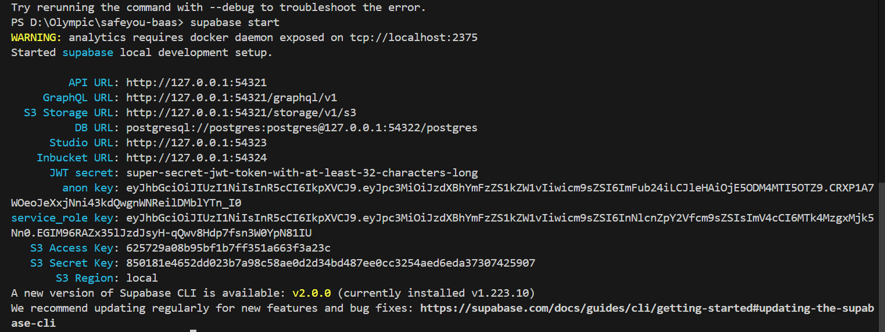
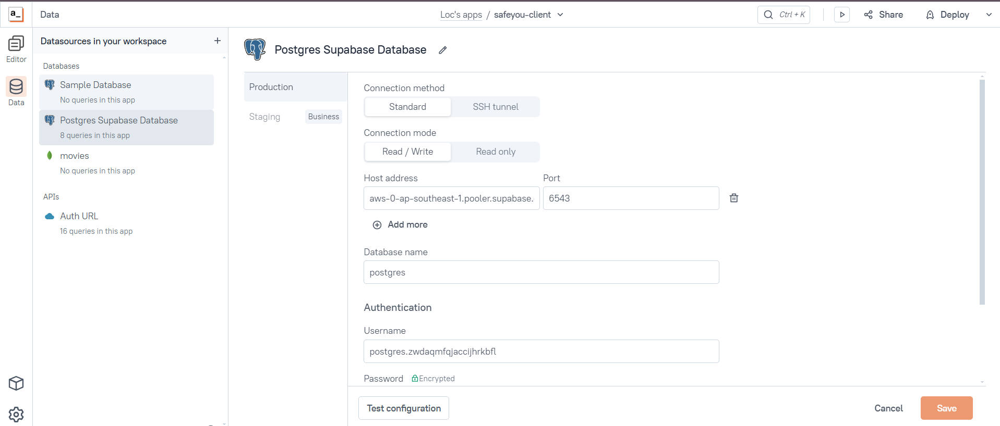
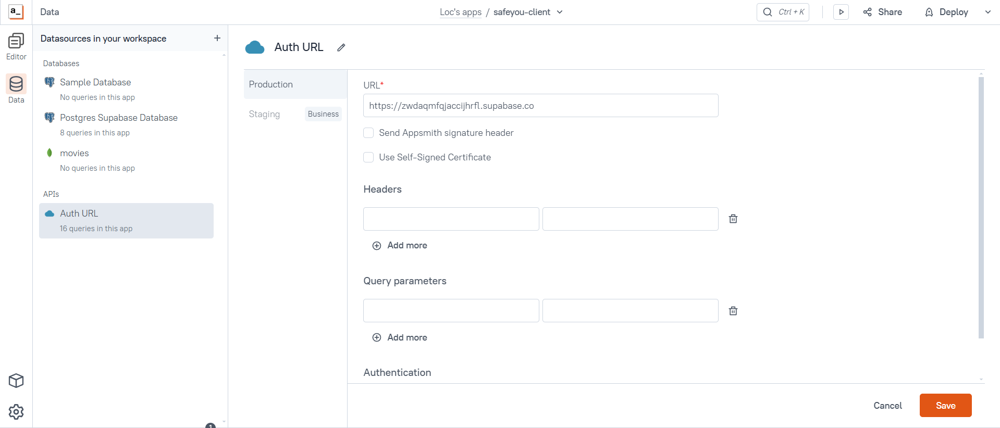

# Hướng dẫn cài đặt frontend
### Các bước cài đặt
#### Cách 1: Import dự án từ GitHub
#### 1. Truy cập mã nguồn từ Github:
####  Đối với app Quản trị viên
Truy cập link
[Tại đây](https://github.com/UTE-SafeYou/safeyou-internals).

####  Đối với app Người dùng 
Truy cập link
[Tại đây](https://github.com/UTE-SafeYou/safeyou-client).

#### 2. Lấy mã git SSH và import vào trên Appsmith:

1. Fork repository.
2. Lấy mã SSH và import vào trên Appsmith
3. Tạo một nhánh mới cho tính năng hoặc bản sửa lỗi của bạn.
3. Commit thay đổi và đẩy chúng lên nhánh của bạn.

#### Cách 1: Import dự án từ file Export JSON

Truy cập link
[Tại đây](https://docs.appsmith.com/advanced-concepts/more/backup-restore).

Sau khi import ta sẽ config lại một số thông số theo SafeYou BaaS sau khi chạy `supabase start`:

    

##### Database

    

##### Base URL

    

### Tài khoản mặc định

- User:
    - Email: `user@gmail.com`
    - Password: `123465`
- Admin:
    - Email: `admin@gmail.com`
    - Password: `123465`
