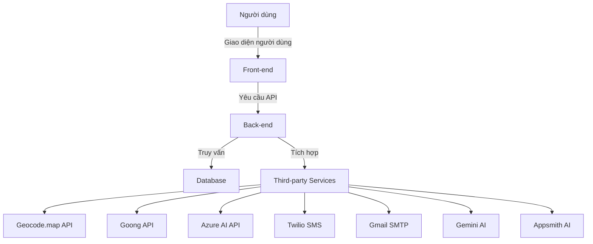

# Tổng quan

# Kiến trúc hệ thống Safe You

## Tổng quan

Safe You là một hệ thống hỗ trợ ứng phó tình huống khẩn cấp, khắc phục thiệt hại và cung cấp thông tin an toàn cho cộng đồng. Hệ thống bao gồm các thành phần chính như sau:

- **Front-end**: Giao diện người dùng
- **Back-end**: Xử lý logic nghiệp vụ và quản lý dữ liệu
- **Database**: Lưu trữ dữ liệu
- **Third-party Services**: Các dịch vụ bên thứ ba hỗ trợ

## Thành phần hệ thống

### 1. Front-end

- **Công nghệ sử dụng**: React
- **Chức năng chính**:
  - Hiển thị bản đồ tương tác
  - Nhận cảnh báo theo vị trí GPS
  - Hỗ trợ nhân đạo sau thảm họa
  - Cập nhật thông tin và hướng dẫn an toàn
  - Đóng góp thông tin từ người dùng

### 2. Back-end

- **Công nghệ sử dụng**: Node.js, Express
- **Chức năng chính**:
  - Xử lý yêu cầu từ Front-end
  - Quản lý người dùng và phân quyền
  - Gửi cảnh báo đến người dùng qua SMS, Email
  - Phân công nhiệm vụ và quản lý tình huống khẩn cấp
  - Tích hợp với các dịch vụ bên thứ ba

### 3. Database

- **Công nghệ sử dụng**: PostgreSQL
- **Chức năng chính**:
  - Lưu trữ thông tin người dùng
  - Lưu trữ thông tin cảnh báo và tình huống khẩn cấp
  - Lưu trữ dữ liệu về các trung tâm hỗ trợ và khu vực an toàn

### 4. Third-party Services

- **Geocode.map API**: Cung cấp thông tin địa lý
- **Goong API**: Cung cấp bản đồ Việt Nam và thế giới
- **Azure AI API**: Cung cấp AI và Machine Learning của Microsoft
- **Twilio SMS**: Gửi SMS và gọi điện thoại để gửi cảnh báo
- **Gmail SMTP**: Gửi email thông báo đến người dùng
- **Gemini AI**: Hỗ trợ tìm kiếm tài liệu
- **Appsmith AI**: Cung cấp LLM của Appsmith

## Kiến trúc triển khai

### 1. Môi trường phát triển

- **Docker**: Sử dụng Docker để triển khai các thành phần của hệ thống
- **N8N**: Quản lý quy trình làm việc
- **RabbitMQ**: Xử lý hàng đợi tin nhắn

### 2. Môi trường sản xuất

- **Kubernetes**: Quản lý triển khai và mở rộng hệ thống
- **CI/CD**: Sử dụng các công cụ CI/CD để tự động hóa quá trình triển khai

## Sơ đồ kiến trúc

